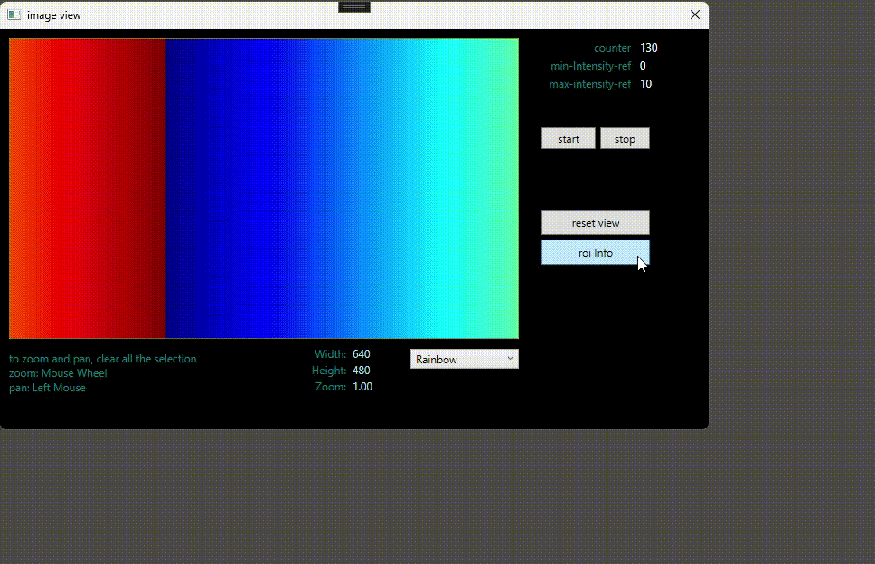

## Introduction
This project is a data visualization application for 2D array values with pre-defined color mappings. It features a WPF bitmap image user control with zoom/pan and ROI (Region of Interest) overlay support.

Data mapping, ROI drawing, and zoom/pan are fully functional. The projects are actively being updated to:
* Extend test coverage
* Improve code quality

## Project List

### Libraries
- IntensityMapping.Core (netstandard2.0)
- WpfCanvasDrawing (net8.0-windows, net48)
- WpfIntensityView (net8.0-windows, net48)

### Sample Application
- IntensityValueGeneration (netstandard2.0)
- DemoAppNet (WPF app, net8.0-windows, net48)

### Test Projects
- IntensityMapping.Core.Tests (net8.0)

## Build and Test

**Format the source code:**
```sh
# from the solution directory
dotnet format
```

**Build:**
```sh
# from the solution directory
dotnet build
```

**Test:**
```sh
# from the solution directory
dotnet test
```

## NuGet Package

All libraries under `src/` are packaged into a single NuGet package: **IntensityMapImageViewer**.

**Build and pack (one step):**
```sh
.\build.ps1
```

This will:
1. Build the solution in Release configuration
2. Pack the NuGet package to the `build/` folder
3. Display the package contents for verification

**Pack manually:**
```sh
dotnet build -c Release
nuget pack src\WpfIntensityView\IntensityView.nuspec -OutputDirectory build
```

**Using the package locally:**

The `NuGet.Config` includes a local feed pointing to the `build/` folder. To reference the package in a project:
```xml
<PackageReference Include="IntensityMapImageViewer" Version="1.0.0-alpha" />
```

**Package contents:**

| Assembly | Description |
|----------|-------------|
| IntensityMapping.Core | Shared data model and intensity-to-byte conversion |
| IntensityValueGeneration | Periodic intensity data source for testing |
| WpfCanvasDrawing | ROI graphics drawing overlays |
| WpfIntensityView | WPF image view control with color mapping |

Supported frameworks: `net8.0-windows`, `net48`

## Project Details

### Intensity Mapping (IntensityMapping.Core.csproj)
Shared data model and intensity value conversion to byte value (e.g. 0.0~10.0 to 0~255).

#### Color Mapping Samples
##### Rainbow

##### Ironbow


### Wpf Canvas Drawing (WpfCanvasDrawing.csproj)
ROI graphics drawing overlays on top of the image view. Canvas drawing code was referenced from https://github.com/songzhu/DrawToolsWPF with necessary changes for ROI rectangle drawing.

### Wpf Intensity View (WpfIntensityView.csproj)
Data is mapped to RGB values and rendered as a bitmap source using the selected color mapping (e.g. rainbow, ironbow).
WPF image view control for displaying data with selected color mapping.

### Intensity Value Generation (IntensityValueGeneration.csproj)
Utility classes that provide periodic intensity data generation for testing.
Can be used as a sample data source instead of real data providers (e.g. sensor/thermal camera).

### Demo App (DemoAppNet)
Demonstrates 2D intensity values (thermal data) mapped to RGB image display in a WPF application, using the IntensityMapImageViewer library.


## Structure
```sh
build.ps1
Directory.Build.props
NuGet.Config
README.md
build/
  IntensityMapImageViewer.*.nupkg
src/
  IntensityMapping.Core/
  IntensityValueGeneration/
  WpfCanvasDrawing/
  WpfIntensityView/
sample/
  DemoAppNet/
test/
  IntensityMapping.Core.Tests/
```